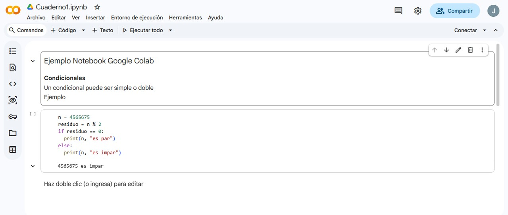
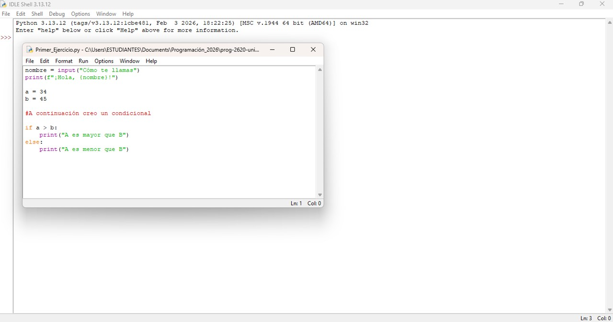
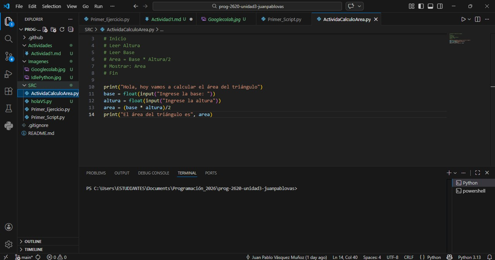

# Actividad 1: Ambiente de Desarollo Integrado (IDE)

## ¿Qué es un IDE?
Por sus siglas (Ambiente de Desarrollo Integrado). Se define como un conjunto de herramientas entre las que se incluye un editor de texto. Nos facilita la tarea de editar código fuente y ejecutar programas realizados, ya que incorporan muchas ayudas, que incluyen visualizar errores y más. 

### Codigo en Google Colab
Creación de cuenta de Google Colab: 

 

En la primera parte del codigo, emplee la posibilidad del archivo MarkDown, para agregar el titulo del código. Y en la parte inferior escribí el siguiente codigo visto en clase:

    n = 4565675
    residuo = n % 2
    if residuo == 0:
        print(n, "es par")
    else:
        print(n, "es impar")

### Imágenes utilizando IDEs

**IDLE Python**
En el IDE de Python, llamado IDLE, se aprendió a utilizar el entorno y se escribieron un par de lineas de código de ejemplo.  

**IDE: Visual Studio Code**
En Visual Studio Code aprendimos a utilizarlo para emplear Python y cómo ejercutarlo. 

**IDE: Goggle Colab**
En Visual Studio Code aprendimos a utilizarlo para emplear Python y cómo ejercutarlo. 

### Preguntas a responder.
1. ¿Qué es un IDE?

> Un IDE es un programa especifico que nos   permite, como usuarios, crear y editar código.  Son especiales para identificar errores de   programación, pero sobre todo, son muy importantes para llevar a acabo nuestros   proyectos.  
      
2. ¿Cuál es la diferencia entre los 3 IDEs estudiados en esta actividad?

> Se vieron en clase tres IDEs, el IDLE de   python, Visual Studio Code y Google Colab. IDLE es un entorno básico, especialmente, para aprender lo principal de Python. En cambio,   Visual Studio Code es un editor de código un   poco más avanzado y se puede personalizar con   gran facilidad. Google Colab es un   editor de código fuente, y lo que más me gusta   es la forma de trabajar en los   Notebooks, teniendo una parte de archivo .md (markdown) y edicción de código.  

3. ¿Cuál utilizarás en el resto del curso y por qué?

> Para el resto del curso, desde mi gusto,   empleare Visual Studio Code, ya que me permite   personalizar el ambiente como más me   gusta, y me resulta más comodo para   proyectos personales y emplear multiples   lenguajes.