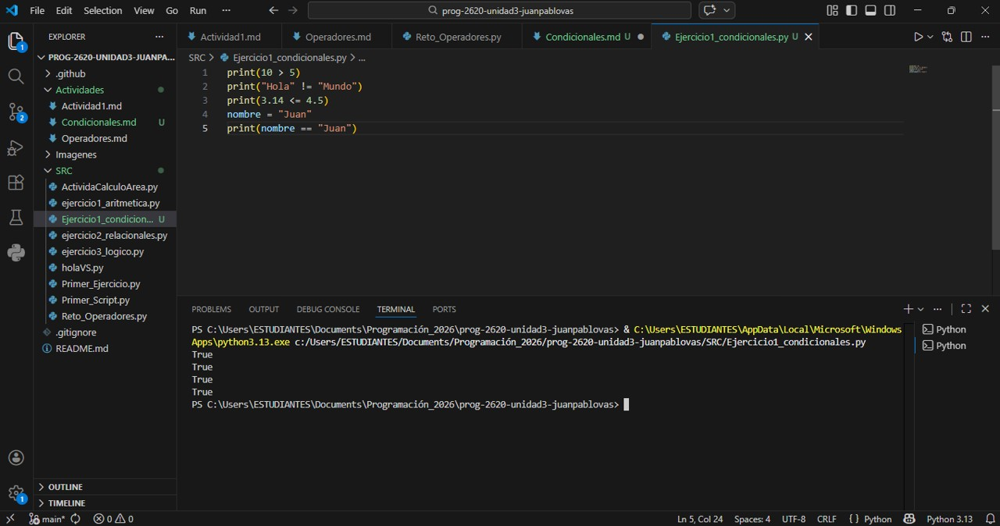
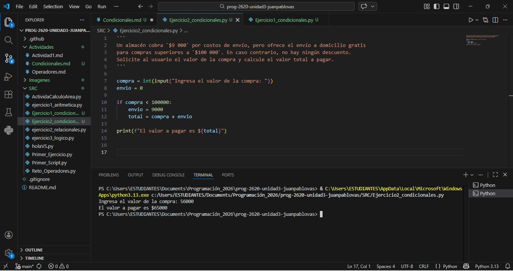
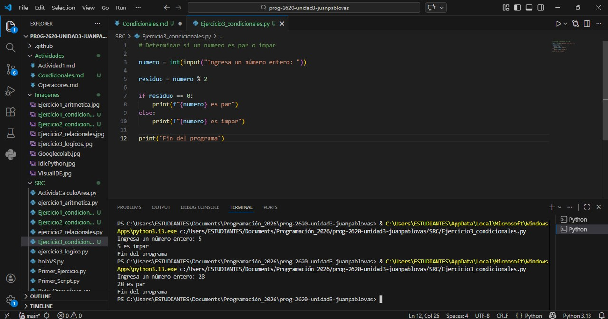

# Condicionales en Python
Son herramientas esenciales en programación que permiten que un programa tome decisiones y realice diferentes accionnes basadas en ciertas condiciones 

## Operadores Relacionales (Comparación)
En Python contamos con los siguientes operadores relacionales.    

 |Operador|Descripción|
 |- |-|
 |== |Igual que|
 |!= |Diferente que|
 |> |Mayor que|
 |< |Menor que|
 |>= |Mayor igual|
 |<= |Menor igual| 

### Ejercicio 1
Comprobación en la consola de Python de los códigos.

# Condicionales
Existen tres tipos de condicionales  
- Simple  
- Doble  
- Múltiple  

## Condicional Simple
Se emplea la palabra if, que significa "si". Se utliza para cumplir una unica condición.

### Ejercicio 2
Resuelve el siguiente problema usando el condicional simple.

Un almacén cobra `$9 000` por costos de envío, pero ofrece el envío a domicilio gratis para compras superiores a `$100 000`. En caso contrario, no hay ningún descuento. Solicite al usuario el valor de la compra y calcule el valor total a pagar.

Comprobación  

## Condicional doble 
Se utilizan cuando existen dos posiblidades.  

### Ejercicio 3
Determinar si un número es par o impar  

## Condicional múltiple

