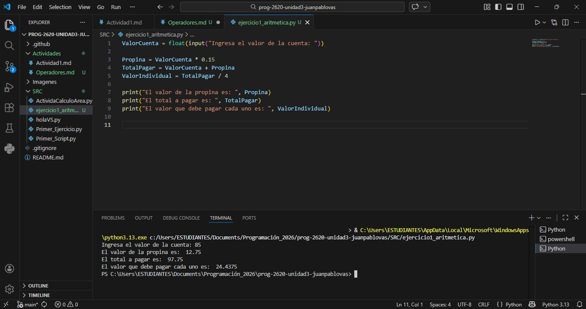
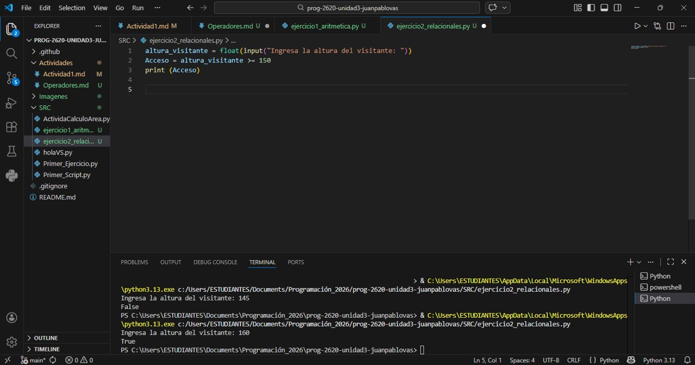
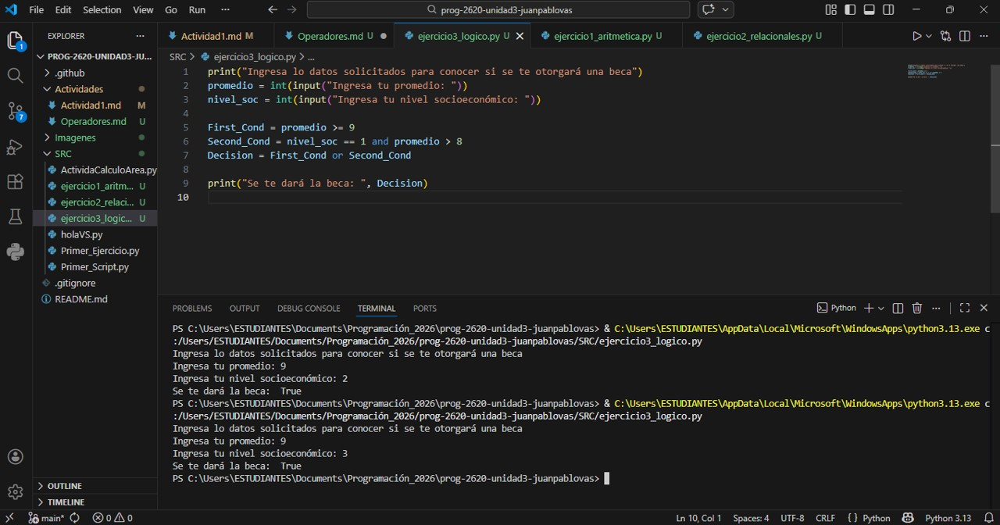

# Operadores en Python

## Pregunta Orientadora 🧐 

- Piensa en tu día a día. ¿Cuántas veces realizas cálculos mentales (como saber si te alcanza el dinero) o tomas decisiones basadas en condiciones (como "si llueve Y hace frío, llevo abrigo")? ¿Cómo crees que le enseñamos a una computadora a hacer exactamente lo mismo?   

  
**Respuesta**    
Considero que una computadora le enseñamos a hacer cálculos o tomar decisiones, por medio del diseño de un algoritmo que nos permita solucionar dicho problema, este diseño implica ser claros y precisos con los datos o las fuentes de información respondiendo a preguntas acerca de cómo se van a tomar, cómo se van a intepretar, cómo se van a utilizar y cómo se van a operar.

## Conceptos importantes

- Utilidad de un programa: cuando necesita procesar información, calcular totales, comparar datos o tomar decisiones lógicas. 

- Python nos ofrece operadores aritméticos, relacionales y lógicos.

## Operadores Aritméticos:   
En Python contamos con los siguientes operadores aritméticos.  

|Operador|Descripción|Ejemplo|
 |- |-|-|
 |+ |Suma|3 + 2 = 5|
 |- |Resta|3 - 2 = 1|
 |* |Multiplicación|2 * 3 = 6|
 |/ |División Completa|3 / 2 = 1.5|
 |// |División entera|3 // 2 = 1|
 |% |Módulo (residuo)|10 % 2 = 0 |
 |** |Potenciación|2 ** 4 = 16|

 ### Ejercicio 1
 Imagina que fuiste a cenar con 3 amigos (son 4 en total). La cuenta fue de $85. Además, quieren dejar un 15% de propina.
Escribe un programa en Python que calcule:

1. El total de la propina. 

2. El total a pagar (cuenta + propina). 

3. Cuánto debe pagar cada uno, dividiendo en partes iguales.

**Pseudocódigo**

        Inicio
            ValorCuenta = 0
            Leer ValorCuenta

            Propina = ValorCuenta * 0.15
            TotalPagar = ValorCuenta + Propina
            ValorIndividual = Total a pagar/4

            Mostrar Propina
            Mostrar TotalPagar
            Mostrar ValorIndividual
        Fin

**Captura Código**  

    
## Operadores Relacionales (Comparación)
En Python contamos con los siguientes operadores relacionales.  

 |Operador|Descripción|
 |- |-|
 |== |Igual que|
 |!= |Diferente que|
 |> |Mayor que|
 |< |Menor que|
 |>= |Mayor igual|
 |<= |Menor igual| 

### Ejercicio 2
💡 **Ejercicio 2: El guardián de la montaña rusa**  
Para subir a la nueva montaña rusa del parque, los visitantes deben medir al menos 150 cm.
Escribe un programa donde declares una variable `altura_visitante` (asígnale el valor que quieras). Luego, utiliza un operador relacional para imprimir `True` si puede subir o `False` si no puede.

        Inicio
            leer altura_visitante
            Acceso = altura_visitante >= 150
            mostrar Acceso
        Fin

**Captura Código**  

## Operadores Lógicos
En python tenemos los siguientes operadores lógicos

|Operador|Descripción|Es True|
 |- |-|-|
 |and |Y lógico|Si ambas condiciones son verdaderas|
 |or |O lógico|Si al menos una de las condiciones es veradera|
 |not |No Lógico|Invierte el valor de true a False y viceversa|

 ### Ejercicio 3
💡 **Sistema de Becas**
Una universidad otorga becas a los estudiantes si cumplen **alguna** de estas dos condiciones:

- Tener un promedio mayor o igual a 9.0.
- Estar en un nivel socioeconómico nivel 1 **Y** tener un promedio mayor a 8.0.

        Inicio
            leer promedio
            leer nivel_soc

            PrimeraCondicion = promedio >=9
            SegundaCondicion = nivel_soc == 1 and promedio > 8
            Decision = PrimeraCondicion or SegundaCondicion

            mostrar Decision
        Fin

**Captura Código**  

## Reto Final - Semana

¡Es hora de poner a prueba todo lo que has aprendido juntando los tres tipos de operadores!

🏆 **Reto Final: El Validador de Videojuegos**
Estás programando la lógica de una tienda de videojuegos en línea. Un usuario quiere comprar un juego de clasificación "M" (Mature / Para mayores de 17 años) que cuesta $60.

 Crea un programa que declare las siguientes variables:
 
 - `edad_usuario` (asigna un número)
 - `saldo_billetera` (asigna un número decimal)
 - `tiene_suscripcion_premium` (asigna `True` o `False`)
 
 Tu programa debe evaluar y guardar en una variable llamada `compra_exitosa` (que será True o False) si el usuario puede comprar el juego.
 
 **Condiciones para que la compra sea exitosa:**
 
 1. El usuario debe tener al menos 17 años.
 2. El usuario debe tener suficiente saldo en su billetera. ¡Pero atención! Si tiene suscripción premium, el juego tiene un 10% de descuento.
 
 *Pista: Primero calcula el precio final usando operadores aritméticos y luego evalúa la lógica con operadores relacionales y lógicos.*
 
 📤 **Acción en Bitácora:** Sube el código de tu Reto Final a tu repositorio en un archivo llamado `reto_operadores.py`. En tu archivo Markdown de bitácora, explica brevemente qué se te dificultó más de este reto y cómo lo resolviste. ¡Mucho éxito!

 