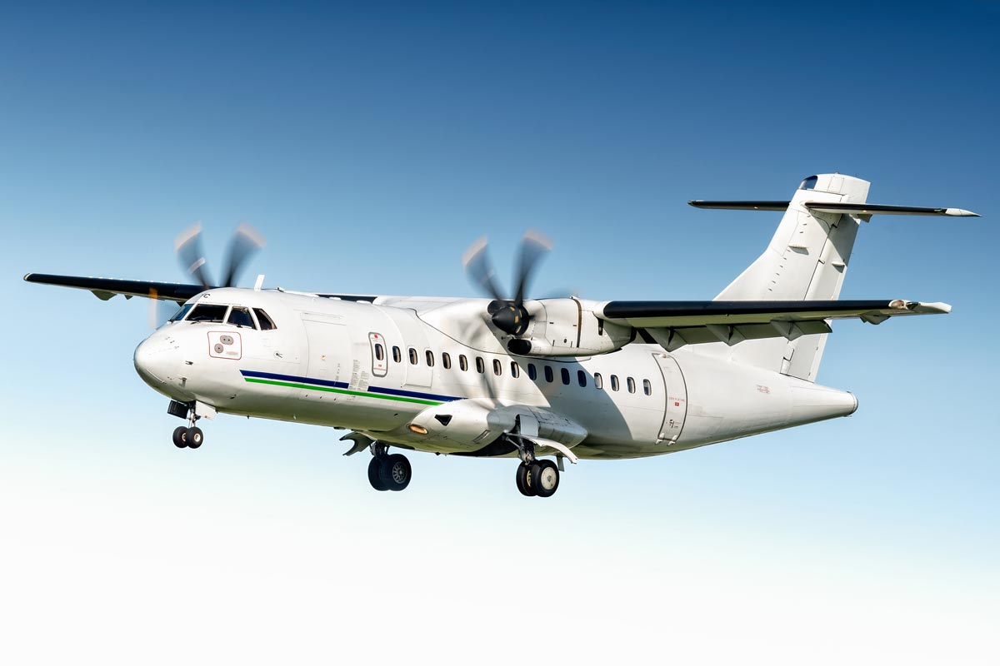
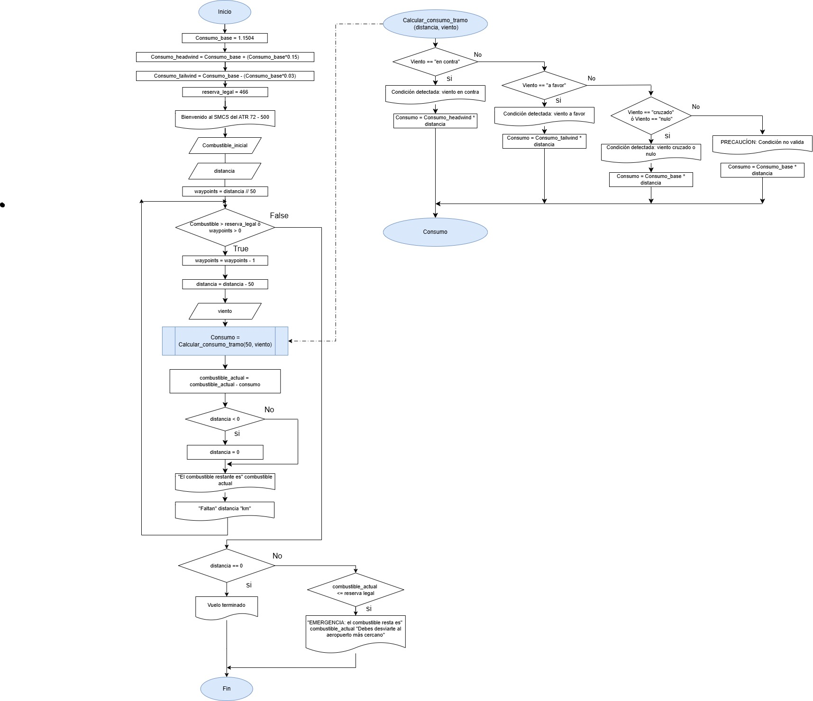
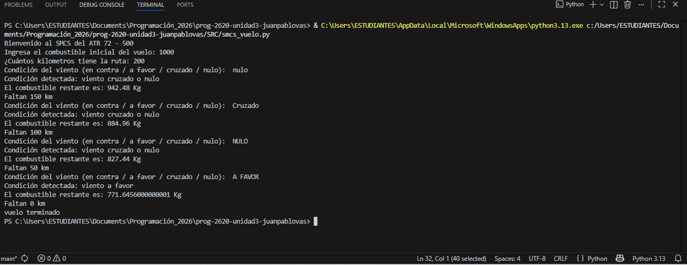
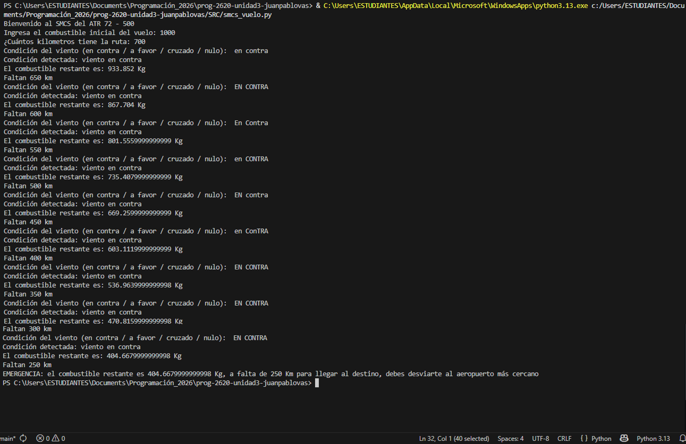

# Reto de Programación: Sistema de Monitoreo Combustible y Seguridad en Ruta (SMCS) ✈️

## Idea General
En la aviación comercial, la gestión del combustible es un factor crítico de seguridad y eficiencia. Un avión no solo debe llevar combustible para llegar a su destino, sino también reservas legales para emergencias, desvíos por clima y tiempos de espera. Las condiciones de ruta, como el viento en contra o a favor, alteran dinámicamente el consumo.

## Pregunta inicial
¿Cómo podemos utilizar la lógica computacional para predecir el consumo de combustible de una aeronave en tiempo real y tomar decisiones de desvío automático que garanticen la seguridad del vuelo?

**Respuesta Propuesta**  

La logica computacional se puede usar para predecir el consumo de combustible de una aeronave en tiempo real. En un primer lugar, es importante conocer los datos o infomación de la aeronave, posición, altitud, actitud, velocidad, aceleración, entre otros datos. También, es importante conocer las condiciones atmosfericas para conocer dirección del viento o demás aspectos que afecten el vuelo. Todo esto como datos de entrada para hacer una serie de analisis y tomar decisiones que garanticen la seguridad operacional del vuelo. 

## Desafío
Eres el ingeniero aeronáutico encargado de programar el **SMCS**, un sistema básico a bordo de un bimotor comercial. El avión tiene una ruta programada que consta de **un número de tramos (waypoints)**. Tu programa debe simular el vuelo, calculando el combustible restante después de cada tramo y tomando decisiones críticas si las reservas se ven comprometidas.

**Reglas del Sistema:**

1. **Capacidad Inicial:** El avión despega con un valor de combustible en el tanque en kilogramos.  

2. **Consumo Base:** investiga cuál podría ser un consumo estándar en kilogramos por kilómetro.  

3. **Efecto del Viento:**
    - Si hay viento en contra (Headwind), el consumo aumenta en “digamos” un 20%. Este valor, lo debes investigar tú y lo debes justificar. No puede ser el mismo de los otros grupos.
    - Si hay viento a favor (Tailwind), el consumo se reduce en `otro valor` que investigarás también.
    - Si el viento es cruzado o nulo, el consumo es el base.  

4. Reserva Legal: El avión nunca puede bajar de un valor de combustible (este será el límite que tú debes definir). Si al proyectar el siguiente tramo el combustible caerá por debajo de este límite, el sistema debe emitir una alerta crítica, abortar la ruta y aterrizar en el aeropuerto alterno más cercano

# Fases del Proyecto

## Fase 1: Análisis del Problema y Tabla de Datos
La aeronave seleccionada para el desarrollo del proyecto es: 

    ATR 72- 500

Fuente de imagen: https://airlinesconnection.com/aircraft-charter/passenger-airliner-charter/regional-aircraft/atr72-500

**Tabla de Entradas (Inputs)**  

 |Inputs|Descripción|
 |-|-|
 |combustible_inicial|Es el combustible (Kg) ingresado por el piloto|
 |distancia|Es la distancia en (Km) que ingresa el piloto para el plan del vuelo|
 |viento|la condición del viento a lo largo del vuelo (viento: en contra, a favor o nulo/cruzado)|

**Tabla de salidas (Outputs)**   

 |Outputs|Descripción|
 |-|-|
 |combustible_inicial|Es el combustible (Kg) ingresado por el piloto|
 |distancia|Es la distancia en (Km) que ingresa el piloto para el plan del vuelo|
 |viento|la condición del viento a lo largo del vuelo (viento: en contra, a favor o nulo/cruzado)|  
   

**Tabla de Variables de Control**

 |Variables de Control|Descripción|
 |-|-|
 |waypoints|Número de tramos del vuelo|
 |combustible_actual| Es el combustible restante de acuerdo al consumo|
 |distancia|Determina cuántos tramos tiene el vuelo y el recorrido|
 |viento|Determina la condición del viento|

**Tabla de Constantes**

 |Constantes|Descripción|
 |-|-|
 |consumobase|1.1504 Kg/km|
 |consumo_headwing| 1.1504 + (1.1504*0.15)|
 |consumo_tailwind| 1.1504 - (1.1504*0.03)|
 |reserva_legal|466 kg|

**Investigación del Consumo ATR 72-500**

En promedio un ATR 72-500 consume 650 kg de combustible por hora, y puede alcanzar una velocidad de 565 km/h  

Con base en esto, se tiene que: 

    (650 kg/h) / (565 Km/h) = 1.1504 Kg/km

    Consumo base = 1.1504 Kg(Km)

El ATR 72 - 500 cuando tiene viente en contra puede consumir entre un 5% y un 15% más del consumo base de combustible.

Por lo tanto:

    Consumo Headwind = 15%

El ATR 72 - 500 cuando tiene viente a favor, la velocidad del viento reduce el consumo de combustible base entre 5% y 10%.  

Por lo tanto:

    Consumo Tailwind = 3%

Fuente: Global Military.  

**Dirección:**

    https://www.globalmilitary.net/es/aircraft/atr-72/

## Fase 2: Diseño de la Solución

**Pseudocódigo**

    Inicio

    consumo_base = 1.1504
    consumo_headwind = consumo_base + (consumo_base * 0.15)
    consumo_tailwind = consumo_base - (consumo_base * 0.03)
    reserva_legal = 466

    #Definición de la función

    Calcular_consumo_tramo(distancia, viento)

        Si viento == "en contra"
            Escribir "Condición detectada: viento en contra"
            consumo = consumo_headwind * distancia

        SiNo Si viento == "a favor"
            Escribir "Condición detectada: viento a favor"
            consumo = consumo_tailwind * distancia

        SiNo Si viento == "cruzado" O viento == "nulo"
            Escribir "Condición detectada: viento cruzado o nulo"
            consumo = consumo_base * distancia

        SiNo
            Escribir "PRECAUCIÓN: condición no válida"
            consumo = consumo_base * distancia
    FinSi

    Retornar consumo
    
    #Fin de la definición de la funcíon

    Escribir "Bienvenido al SMCS del ATR 72 - 500"

    Leer combustible_inicial
    Leer distancia

    waypoints = distancia // 50

    combustible_actual = combustible_inicial

    Mientras combustible_actual > reserva_legal Y waypoints > 0

        waypoints = waypoints - 1
        distancia = distancia - 50

        Leer viento

        consumo = Calcular_consumo_tramo(50, viento)

        combustible_actual = combustible_actual - consumo

        Si distancia < 0
            distancia = 0
        FinSi

        Escribir "El combustible restante es:", combustible_actual, "Kg"
        Escribir "Faltan", distancia, "km"

    FinMientras

    Si distancia = 0
        Escribir "Vuelo terminado"

    Sino si combustible_actual <= reserva_legal

        Escribir "EMERGENCIA: el combustible restante es", combustible_actual
        Escribir "Debes desviarte al aeropuerto más cercano"
    Fin si

    Fin

**Diagrama de Flujo**

## Fase 3 y 4: Código Fuente e Implementación en Python

**Código fuente**

**Capturas de pantalla**
1) Un vuelo exitoso que llega a su destino con combustible por encima de la reserva.  

2) Un vuelo que encuentra demasiado viento en contra y el sistema se ve forzado a abortar la misión por falta de combustible.  

